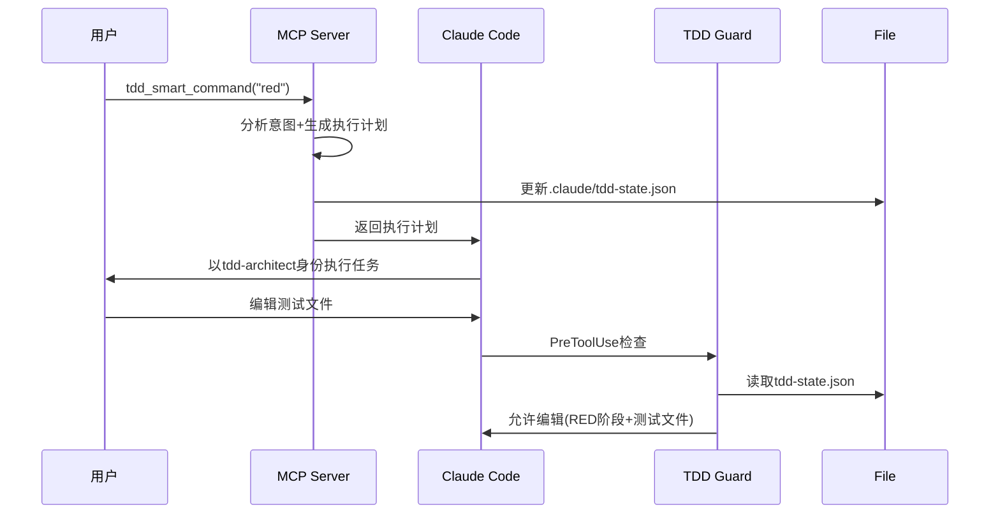

# MCP与Claude Code智能协调方案

## 🤔 核心问题

**问题**: MCP是否可以指导或控制Claude Code准确执行commands、agents等功能？

**答案**: 不能直接控制，但可以实现**智能协调模式**

## 🚫 技术边界限制

### 无法直接控制的功能
- ❌ 不能直接触发 `/tdd:red`, `/tdd:green` 等slash commands
- ❌ 不能强制激活特定agents (如tdd-architect)
- ❌ 不能直接修改Claude Code运行时状态
- ❌ 不能绕过用户自动执行操作

### MCP工具的能力边界
- ✅ 返回结构化数据和文本内容
- ✅ 读写文件系统（包括配置文件）
- ✅ 执行系统命令
- ✅ 分析项目状态

## ✅ 智能协调解决方案

### 方案1: 执行计划模式 (推荐)

**核心思路**: MCP生成标准化的执行计划，Claude解析并执行

```json
// MCP返回的执行计划格式
{
  "phase": "red",
  "agentSuggestion": "tdd-architect",
  "task": "编写Calculator.power()方法的失败测试",
  "instructions": "请立即切换为tdd-architect身份，在RED阶段编写测试用例...",
  "allowedFiles": ["tests/", "*.test.*", "*.spec.*"],
  "blockedFiles": ["src/", "lib/", "main/"],
  "nextSteps": [
    "编写失败的测试用例",
    "运行测试确认失败", 
    "准备进入GREEN阶段"
  ]
}
```

**实现机制**:
1. **MCP智能路由**: 分析用户意图，生成执行计划
2. **Claude解释执行**: 读取计划，自动切换工作模式
3. **状态文件同步**: MCP更新.claude/tdd-state.json
4. **Hooks权限控制**: 基于状态文件限制文件编辑

### 方案2: 配置文件协调模式

**核心思路**: MCP通过修改配置文件间接控制Claude Code行为

```javascript
// MCP修改 .claude/tdd-state.json
{
  "currentPhase": "red",
  "featureId": "CALCULATOR_POWER",
  "agentMode": "tdd-architect",
  "restrictions": {
    "allowedPaths": ["tests/", "*.test.*"],
    "blockedPaths": ["src/", "lib/"]
  },
  "guidance": "当前RED阶段：请编写失败测试"
}
```

**配合hooks实现权限控制**:
```javascript
// tdd_guard.js 读取状态文件
const tddState = readJSONSafe('.claude/tdd-state.json');
const currentPhase = tddState?.currentPhase?.toLowerCase();
const restrictions = tddState?.restrictions;

// 根据配置限制文件编辑
if (restrictions && !isAllowedPath(filePath, restrictions)) {
  return blockEdit();
}
```

### 方案3: 指令建议模式

**核心思路**: MCP返回明确的操作建议，引导用户执行

```markdown
## 🤖 TDD流程建议

基于当前项目状态，建议您：

1. **立即执行**: `/tdd:red`
2. **切换身份**: 请以 **tdd-architect** 身份工作
3. **核心任务**: 编写Calculator.power()方法的失败测试
4. **下一步**: 完成后使用 `/tdd:green` 进入实现阶段

**智能提醒**: 当前RED阶段，只能编辑测试文件，生产代码将被自动阻止
```

## 🏗️ 推荐实现架构

### 整体协调流程



### 核心组件协调

```
MCP Server (智能协调层)
├─ 意图识别: 分析用户自然语言输入
├─ 状态管理: 维护TDD阶段状态
├─ 执行计划: 生成标准化指令
└─ 文件操作: 更新配置文件

Claude Code (智能执行层)  
├─ 计划解析: 理解MCP返回的执行计划
├─ 模式切换: 根据建议切换agent身份
├─ 任务执行: 执行具体的文件操作任务
└─ 状态感知: 读取配置文件调整行为

TDD Guard (权限控制层)
├─ 状态读取: 实时读取tdd-state.json
├─ 权限检查: 基于阶段限制文件编辑
├─ 反模式阻断: 阻止违反TDD的操作
└─ 友好提示: 提供阶段适当的指导
```

## 📝 实际使用示例

### 示例1: 自然语言启动TDD流程

```bash
# 用户输入
tdd_smart_command("开始写测试")

# MCP返回
🔴 **进入TDD RED阶段**

> 请立即切换为 **tdd-architect** 身份，专注编写失败测试：

**当前任务**：
- 编写会失败的测试代码  
- 确保测试失败原因明确（功能未实现）
- 遵循AAA模式：Given-When-Then结构

**允许编辑**：tests/, *.test.*, *.spec.*
**禁止编辑**：src/, lib/, main/ (生产代码)

**🤖 建议Agent**: tdd-architect

**📋 下一步操作**：
1. 编写失败的测试用例
2. 运行测试确认失败  
3. 准备进入GREEN阶段: 使用 tdd_smart_command("green")

**🔄 当前阶段**: ready → red
```

### 示例2: 自动阶段切换

```javascript
// MCP自动更新状态文件
{
  "currentPhase": "red",
  "featureId": "USER_AUTHENTICATION", 
  "timestamp": "2024-01-28T12:00:00Z",
  "agentMode": "tdd-architect",
  "guidance": "RED阶段：编写认证功能的失败测试"
}

// Claude读取状态，自动调整工作模式
// TDD Guard根据状态控制文件编辑权限
```

## 🎯 总结

### 实现的协调效果
- ✅ **智能意图识别**: MCP理解自然语言输入
- ✅ **自动状态管理**: MCP维护TDD阶段状态  
- ✅ **工作模式建议**: 明确指导Claude切换身份
- ✅ **权限精确控制**: Hooks基于状态限制操作
- ✅ **流程自动化**: 减少手动命令输入

### 用户体验提升
- 🚀 **一键启动**: `tdd_smart_command("red")` 即可开始
- 🧠 **智能理解**: 支持自然语言如"开始写测试"
- 🔒 **自动保护**: 违反TDD的操作自动阻止
- 📋 **清晰指导**: 每个阶段都有明确的任务说明
- 🔄 **无缝切换**: 阶段间平滑过渡

虽然无法做到"直接控制"，但这种"智能协调"模式在保持架构清晰的同时，实现了较好的自动化效果。