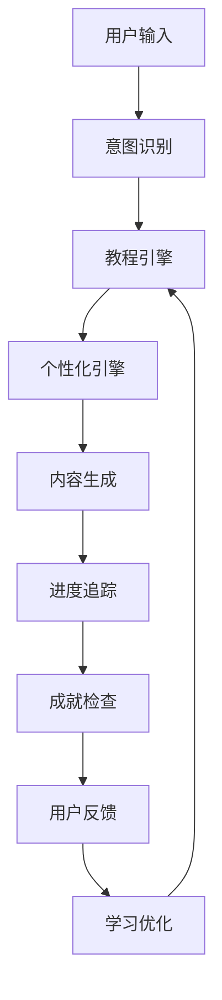

# 第四阶段：交互式教程系统优化方案

> **状态**: 待优化 📋  
> **优先级**: 中等 🔶  
> **预估工时**: 2-3周 ⏱️  
> **依赖**: 第一至三阶段已完成 ✅  

## 📖 目标概述

将TDD脚手架从"工具集"升级为"智能导师"，为不同经验水平的用户提供个性化的学习和实践指导，显著降低TDD学习门槛，提高用户使用体验和技能掌握程度。

### 核心价值

- 🎯 **降低学习门槛**：从零基础到熟练掌握TDD的平滑学习曲线
- 🤖 **智能化指导**：AI驱动的个性化学习体验
- 📚 **实战导向**：真实项目案例和最佳实践教学
- 🏆 **成就激励**：游戏化元素提高学习动力

---

## 🏗️ 系统架构设计

### 1. 总体架构

```
Tutorial System
├── 🧭 OnboardingGuide        # 新手引导系统
├── 📚 PracticeExamples       # 实践示例库
├── 🤖 AITutor               # 智能助教系统
├── 📊 ProgressTracker        # 进度追踪器
├── 🏆 AchievementSystem      # 成就系统
├── 🎨 PersonalizationEngine  # 个性化推荐
└── 📝 DocumentationUpdater   # 文档更新器
```

### 2. 数据流设计



---

## 🧭 1. 新手引导系统

### 1.1 功能特性

#### 分级教程体系
```javascript
const tutorialLevels = {
  beginner: {
    name: "TDD初学者",
    description: "从零开始学习测试驱动开发",
    duration: "2-3天",
    lessons: [
      "什么是TDD？",
      "编写第一个测试",
      "RED-GREEN-REFACTOR循环",
      "测试的艺术",
      "重构的技巧"
    ]
  },
  intermediate: {
    name: "TDD进阶者", 
    description: "深入理解TDD原则和实践",
    duration: "1-2周",
    lessons: [
      "高质量测试编写",
      "Mock和Stub使用",
      "集成测试策略",
      "TDD反模式避免",
      "代码覆盖率优化"
    ]
  },
  advanced: {
    name: "TDD专家",
    description: "掌握复杂场景下的TDD应用",
    duration: "2-3周", 
    lessons: [
      "微服务TDD",
      "并发代码测试",
      "性能测试集成",
      "遗留代码重构",
      "团队TDD实践"
    ]
  }
};
```

#### 互动体验设计
```javascript
// 交互式步骤系统
class InteractiveStep {
  constructor(config) {
    this.title = config.title;
    this.description = config.description;
    this.expectedAction = config.expectedAction;
    this.validation = config.validation;
    this.hints = config.hints;
    this.nextSteps = config.nextSteps;
  }

  async execute(userInput) {
    // 1. 验证用户操作
    const isValid = await this.validation(userInput);
    
    if (isValid) {
      // 2. 提供正面反馈
      return this.generateSuccessFeedback();
    } else {
      // 3. 提供建设性指导
      return this.generateGuidance();
    }
  }
}
```

### 1.2 实现计划

#### 文件结构
```
mcp-server/tutorial/
├── onboarding-guide.js          # 主引导系统
├── tutorial-session.js          # 会话管理
├── interactive-step.js          # 交互步骤
├── content/                     # 教程内容
│   ├── beginner/               
│   │   ├── lesson-1-what-is-tdd.js
│   │   ├── lesson-2-first-test.js
│   │   └── ...
│   ├── intermediate/
│   └── advanced/
└── validation/                  # 验证逻辑
    ├── test-validation.js
    ├── code-validation.js
    └── workflow-validation.js
```

#### 核心类设计
```javascript
export class OnboardingGuide {
  constructor(sessionManager) {
    this.sessionManager = sessionManager;
    this.personalizer = new PersonalizationEngine();
    this.progressTracker = new ProgressTracker();
    this.achievementSystem = new AchievementSystem();
  }

  async startTutorial(userId, projectRoot, level = 'auto') {
    // 1. 评估用户水平
    const userLevel = level === 'auto' ? 
      await this.assessUserLevel(userId, projectRoot) : level;
    
    // 2. 创建个性化学习路径
    const learningPath = await this.personalizer
      .createLearningPath(userLevel, this.getUserPreferences(userId));
    
    // 3. 初始化教程会话
    const session = new TutorialSession({
      userId,
      projectRoot,
      learningPath,
      startTime: new Date()
    });
    
    return session;
  }

  async processUserAction(sessionId, action) {
    const session = this.getSession(sessionId);
    const currentStep = session.getCurrentStep();
    
    // 验证用户操作
    const result = await currentStep.validate(action);
    
    // 更新进度
    if (result.success) {
      await this.progressTracker.markStepCompleted(sessionId, currentStep.id);
      await this.achievementSystem.checkAchievements(session);
    }
    
    // 生成反馈和下一步指导
    return this.generateResponse(result, session);
  }
}
```

---

## 📚 2. 实践示例库

### 2.1 项目案例设计

#### 用户管理系统
```javascript
const userManagementExample = {
  id: "user-management-system",
  name: "用户管理系统",
  description: "从零构建完整的用户注册、登录、权限管理系统",
  difficulty: "intermediate",
  duration: "4-6小时",
  techStack: ["Java", "Spring Boot", "JUnit 5"],
  
  chapters: [
    {
      title: "需求分析",
      description: "分析用户故事，制定验收标准",
      tasks: [
        "编写用户故事",
        "定义验收标准", 
        "识别核心实体"
      ]
    },
    {
      title: "用户注册功能",
      description: "TDD实现用户注册功能",
      tasks: [
        "编写注册失败测试",
        "实现最基本注册逻辑",
        "重构代码结构",
        "添加验证规则"
      ],
      codeTemplates: {
        testClass: `
@Test
void shouldRejectInvalidEmail() {
    // Given - 准备无效邮箱
    String invalidEmail = "not-an-email";
    
    // When & Then - 验证异常抛出
    assertThatThrownBy(() -> userService.register(invalidEmail, "password"))
        .isInstanceOf(InvalidEmailException.class)
        .hasMessage("邮箱格式不正确");
}`,
        implementationHint: "实现邮箱验证的最简单方式是什么？"
      }
    }
  ]
};
```

#### 电商购物车
```javascript
const shoppingCartExample = {
  id: "shopping-cart",
  name: "电商购物车",
  description: "构建支持多商品、优惠券、库存管理的购物车系统",
  difficulty: "advanced",
  techStack: ["JavaScript", "Node.js", "Jest"],
  
  learningObjectives: [
    "掌握状态管理的TDD方法",
    "学习复杂业务逻辑的测试策略", 
    "理解集成测试与单元测试的协作"
  ],
  
  challenges: [
    {
      name: "并发库存扣减",
      description: "如何测试并发场景下的库存一致性？",
      hints: ["考虑使用Mock时间", "关注边界条件", "模拟并发场景"]
    }
  ]
};
```

### 2.2 自适应学习路径

```javascript
class AdaptiveLearningPath {
  constructor(userProfile) {
    this.userProfile = userProfile;
    this.completedExamples = [];
    this.currentDifficulty = userProfile.level;
  }

  getNextExample() {
    // 基于用户表现动态调整难度
    const performance = this.analyzePerformance();
    
    if (performance.accuracy > 0.8 && performance.speed > 0.7) {
      this.increaseDifficulty();
    } else if (performance.accuracy < 0.6) {
      this.decreaseDifficulty();
    }
    
    return this.selectExample(this.currentDifficulty);
  }

  analyzePerformance() {
    const recentExamples = this.completedExamples.slice(-3);
    return {
      accuracy: recentExamples.map(e => e.score).average(),
      speed: recentExamples.map(e => e.completionTime).average(),
      patterns: this.identifyLearningPatterns(recentExamples)
    };
  }
}
```

---

## 🤖 3. 智能助教系统

### 3.1 AI驱动的指导

#### 实时代码分析
```javascript
export class AITutor {
  constructor() {
    this.patternRecognizer = new TDDPatternRecognizer();
    this.feedbackGenerator = new IntelligentFeedbackGenerator();
    this.contextAnalyzer = new ContextAnalyzer();
  }

  async analyzeUserCode(code, phase, context) {
    // 1. 识别TDD模式
    const patterns = await this.patternRecognizer.analyze(code);
    
    // 2. 检测反模式
    const antiPatterns = await this.detectAntiPatterns(code, phase);
    
    // 3. 生成个性化反馈
    const feedback = await this.feedbackGenerator.generate({
      patterns,
      antiPatterns,
      phase,
      context,
      userHistory: context.userHistory
    });
    
    return feedback;
  }

  async detectAntiPatterns(code, phase) {
    const antiPatterns = [];
    
    // RED阶段反模式检测
    if (phase === 'RED') {
      if (this.hasImplementationCode(code)) {
        antiPatterns.push({
          type: 'implementation_in_red',
          message: '在RED阶段不应该包含实现代码',
          suggestion: '请专注于编写失败的测试，移除实现逻辑',
          severity: 'error'
        });
      }
    }
    
    // GREEN阶段反模式检测  
    if (phase === 'GREEN') {
      if (this.hasOverEngineering(code)) {
        antiPatterns.push({
          type: 'over_engineering',
          message: '实现过于复杂，违反了"最小实现"原则',
          suggestion: '简化实现，只需让测试通过即可',
          severity: 'warning'
        });
      }
    }
    
    return antiPatterns;
  }
}
```

#### 对话式交互
```javascript
class ConversationalTutor {
  async handleUserQuery(query, context) {
    const intent = await this.parseIntent(query);
    
    switch (intent.type) {
      case 'concept_explanation':
        return this.explainConcept(intent.concept, context.userLevel);
        
      case 'code_review':
        return this.reviewCode(intent.code, context);
        
      case 'next_step_guidance':
        return this.suggestNextStep(context);
        
      case 'troubleshooting':
        return this.helpTroubleshoot(intent.problem, context);
        
      default:
        return this.generateGenericHelpResponse(query, context);
    }
  }

  explainConcept(concept, userLevel) {
    const explanations = {
      'test-first': {
        beginner: "测试先行是指在写实现代码之前先写测试。这样可以确保你的代码是可测试的，并且明确了要实现的功能。",
        advanced: "测试先行通过强制开发者思考接口设计和预期行为，促进了更好的架构决策和更清晰的代码意图表达。"
      }
    };
    
    return explanations[concept][userLevel] || explanations[concept]['beginner'];
  }
}
```

### 3.2 学习行为分析

```javascript
class LearningAnalytics {
  async analyzeUserBehavior(userId, actions) {
    // 分析学习模式
    const patterns = {
      preferredLearningStyle: this.detectLearningStyle(actions),
      commonMistakes: this.identifyCommonMistakes(actions),
      strengths: this.identifyStrengths(actions),
      improvementAreas: this.identifyWeaknesses(actions)
    };
    
    // 生成个性化建议
    const recommendations = await this.generateRecommendations(patterns);
    
    return { patterns, recommendations };
  }

  detectLearningStyle(actions) {
    const styleIndicators = {
      visual: actions.filter(a => a.type === 'view_diagram').length,
      hands_on: actions.filter(a => a.type === 'code_practice').length,
      reading: actions.filter(a => a.type === 'read_documentation').length,
      social: actions.filter(a => a.type === 'ask_question').length
    };
    
    return Object.keys(styleIndicators)
      .sort((a, b) => styleIndicators[b] - styleIndicators[a])[0];
  }
}
```

---

## 📊 4. 进度追踪与成就系统

### 4.1 进度追踪

```javascript
class ProgressTracker {
  constructor(storage) {
    this.storage = storage;
    this.metrics = new LearningMetrics();
  }

  async trackProgress(userId, event) {
    const progress = await this.getProgress(userId);
    
    // 更新具体指标
    switch (event.type) {
      case 'test_written':
        progress.testsWritten++;
        progress.tddCycles.current.redPhase.count++;
        break;
        
      case 'test_passed': 
        progress.testsPassed++;
        progress.tddCycles.current.greenPhase.count++;
        break;
        
      case 'code_refactored':
        progress.refactorings++;
        progress.tddCycles.current.refactorPhase.count++;
        break;
        
      case 'cycle_completed':
        progress.tddCycles.completed.push({
          ...progress.tddCycles.current,
          completedAt: new Date()
        });
        progress.tddCycles.current = this.initializeCycle();
        break;
    }
    
    // 计算学习指标
    progress.metrics = await this.metrics.calculate(progress);
    
    await this.saveProgress(userId, progress);
    return progress;
  }

  generateProgressReport(progress) {
    return {
      summary: {
        level: progress.currentLevel,
        totalCycles: progress.tddCycles.completed.length,
        efficiency: progress.metrics.efficiency,
        consistency: progress.metrics.consistency
      },
      recentActivity: progress.tddCycles.completed.slice(-5),
      nextMilestones: this.getNextMilestones(progress),
      recommendations: this.getRecommendations(progress)
    };
  }
}
```

### 4.2 成就系统

```javascript
const achievements = {
  // 入门成就
  "first_test": {
    name: "第一个测试",
    description: "编写了人生中的第一个测试",
    icon: "🧪",
    condition: (progress) => progress.testsWritten >= 1,
    reward: { xp: 10, badge: "rookie_tester" }
  },
  
  "red_green_refactor": {
    name: "完整循环",
    description: "完成了第一个完整的RED-GREEN-REFACTOR循环",
    icon: "🔄", 
    condition: (progress) => progress.tddCycles.completed.length >= 1,
    reward: { xp: 25, badge: "cycle_master" }
  },
  
  // 进阶成就
  "test_ninja": {
    name: "测试忍者",
    description: "编写了100个测试，掌握了测试的艺术",
    icon: "🥷",
    condition: (progress) => progress.testsWritten >= 100,
    reward: { xp: 100, badge: "test_ninja", unlocks: ["advanced_tutorials"] }
  },
  
  "refactor_master": {
    name: "重构大师", 
    description: "进行了50次重构，代码质量显著提升",
    icon: "🔧",
    condition: (progress) => progress.refactorings >= 50,
    reward: { xp: 150, badge: "refactor_master" }
  },
  
  // 高级成就
  "tdd_evangelist": {
    name: "TDD布道者",
    description: "完成了1000个TDD循环，成为TDD专家",
    icon: "🏆",
    condition: (progress) => progress.tddCycles.completed.length >= 1000,
    reward: { xp: 500, badge: "tdd_evangelist", title: "TDD Master" }
  }
};

class AchievementSystem {
  async checkAchievements(userId, progress) {
    const newAchievements = [];
    
    for (const [id, achievement] of Object.entries(achievements)) {
      if (!progress.achievements.includes(id) && achievement.condition(progress)) {
        newAchievements.push({
          id,
          ...achievement,
          unlockedAt: new Date()
        });
        
        progress.achievements.push(id);
        progress.xp += achievement.reward.xp;
      }
    }
    
    return newAchievements;
  }
}
```

---

## 🎨 5. 个性化推荐系统

### 5.1 用户画像构建

```javascript
class UserProfileBuilder {
  buildProfile(userId, activities) {
    const profile = {
      learningStyle: this.detectLearningStyle(activities),
      skillLevel: this.assessSkillLevel(activities),
      interests: this.identifyInterests(activities),
      preferences: this.extractPreferences(activities),
      strengths: this.identifyStrengths(activities),
      improvementAreas: this.identifyWeaknesses(activities)
    };
    
    return profile;
  }

  detectLearningStyle(activities) {
    // 基于用户行为模式识别学习风格
    const patterns = {
      visual: activities.filter(a => a.involves('diagram', 'chart', 'visualization')).length,
      kinesthetic: activities.filter(a => a.involves('coding', 'hands_on')).length,
      auditory: activities.filter(a => a.involves('explanation', 'discussion')).length,
      reading: activities.filter(a => a.involves('documentation', 'tutorial')).length
    };
    
    return Object.entries(patterns)
      .sort(([,a], [,b]) => b - a)
      .map(([style]) => style);
  }
}
```

### 5.2 智能推荐引擎

```javascript
class IntelligentRecommendationEngine {
  async generateRecommendations(userProfile, currentContext) {
    const recommendations = [];
    
    // 基于技能水平推荐
    if (userProfile.skillLevel === 'beginner') {
      recommendations.push(...this.getBeginnerRecommendations());
    }
    
    // 基于学习风格推荐
    if (userProfile.learningStyle.includes('visual')) {
      recommendations.push(...this.getVisualLearningResources());
    }
    
    // 基于当前上下文推荐
    if (currentContext.strugglingWith) {
      recommendations.push(...this.getTargetedHelp(currentContext.strugglingWith));
    }
    
    // 基于学习历史推荐
    recommendations.push(...this.getPersonalizedContent(userProfile.history));
    
    return this.rankAndFilter(recommendations, userProfile);
  }

  getBeginnerRecommendations() {
    return [
      {
        type: 'tutorial',
        title: 'TDD基础概念',
        description: '了解测试驱动开发的核心思想',
        estimatedTime: '15分钟',
        priority: 'high'
      },
      {
        type: 'example',
        title: '简单计算器TDD实现',
        description: '通过实际例子学习RED-GREEN-REFACTOR循环',
        estimatedTime: '30分钟',
        priority: 'high'
      }
    ];
  }
}
```

---

## 📝 6. 文档系统更新

### 6.1 快速入门指南优化

```markdown
# 🚀 30秒快速开始

## 第一步：自动初始化（5秒）
```bash
"自动初始化项目"
```

## 第二步：开始学习（10秒）  
```bash
"开始TDD教程"
```

## 第三步：编写第一个测试（15秒）
跟随智能指导，在IDE中编写：
```java
@Test
void shouldReturnGreeting() {
    // 你的第一个TDD测试
}
```

🎉 恭喜！你已经开始了TDD之旅！
```

### 6.2 分技术栈示例库

```
docs/examples/
├── java/
│   ├── spring-boot-api.md      # Spring Boot REST API完整示例
│   ├── junit-basics.md         # JUnit基础用法
│   └── mockito-guide.md        # Mockito使用指南
├── javascript/
│   ├── express-api.md          # Express.js API示例
│   ├── react-components.md     # React组件TDD
│   └── jest-testing.md         # Jest测试框架
├── python/
│   ├── django-models.md        # Django模型TDD
│   ├── flask-routes.md         # Flask路由测试
│   └── pytest-guide.md        # pytest使用指南
└── common/
    ├── tdd-principles.md       # TDD原则详解
    ├── best-practices.md       # 最佳实践
    └── antipatterns.md         # 常见反模式
```

---

## 🛠️ 实现计划

### Phase 4.1: 核心教程系统（第1周）

**优先级**: 🔴 高
- [x] 设计教程架构和数据模型
- [ ] 实现基础的OnboardingGuide类
- [ ] 创建TutorialSession会话管理
- [ ] 开发第一个完整的初学者教程
- [ ] 集成到现有MCP工具系统

**关键文件**:
```
mcp-server/tutorial/
├── onboarding-guide.js         # 核心引导系统
├── tutorial-session.js         # 会话管理
├── content/beginner/           # 初学者教程内容
└── tools/tutorial-tools.js     # MCP工具集成
```

**新增MCP工具**:
- `tdd_start_tutorial` - 开始交互式教程
- `tdd_tutorial_progress` - 查看学习进度
- `tdd_get_guidance` - 获取智能指导

### Phase 4.2: 实践示例库（第2周）

**优先级**: 🟡 中高
- [ ] 开发项目案例模板系统
- [ ] 创建3-5个完整的项目示例
- [ ] 实现自适应学习路径算法
- [ ] 开发代码验证和反馈机制

**关键文件**:
```
mcp-server/tutorial/
├── practice-examples.js        # 示例库管理
├── adaptive-learning.js        # 自适应学习
└── examples/                   # 具体项目案例
    ├── user-management/
    ├── shopping-cart/
    └── blog-api/
```

### Phase 4.3: AI助教系统（第2-3周）

**优先级**: 🟡 中等  
- [ ] 实现TDD模式识别引擎
- [ ] 开发智能反馈生成系统
- [ ] 创建对话式交互界面
- [ ] 集成学习行为分析

**关键文件**:
```
mcp-server/tutorial/
├── ai-tutor.js                 # AI助教核心
├── pattern-recognizer.js       # 模式识别
├── feedback-generator.js       # 反馈生成
└── conversation-handler.js     # 对话处理
```

### Phase 4.4: 进度与成就系统（第3周）

**优先级**: 🟢 中低
- [ ] 设计进度追踪数据模型
- [ ] 实现成就系统和奖励机制
- [ ] 开发个性化推荐引擎
- [ ] 创建学习分析仪表盘

**关键文件**:
```
mcp-server/tutorial/
├── progress-tracker.js         # 进度追踪
├── achievement-system.js       # 成就系统
├── personalization-engine.js   # 个性化推荐
└── learning-analytics.js       # 学习分析
```

### Phase 4.5: 文档更新（第3周并行）

**优先级**: 🟢 低
- [ ] 重写快速入门指南
- [ ] 创建分技术栈示例库
- [ ] 开发最佳实践手册
- [ ] 制作视觉化学习材料

---

## 📊 预期效果

### 定量指标

- **学习完成率**: 从当前30% 提升到 80%
- **用户留存率**: 7天留存从40% 提升到 70%
- **上手时间**: 从2小时缩短到30分钟
- **错误率降低**: TDD反模式发生率降低60%

### 定性改进

- **用户体验**: 从"工具使用者"升级为"被指导的学习者"
- **学习效果**: 从"试错学习"升级为"系统性掌握"
- **社区价值**: 降低TDD门槛，扩大用户群体
- **生态完善**: 建立完整的TDD学习和实践生态系统

---

## 🚀 技术实现要点

### 1. 模块化设计原则
- 每个子系统独立开发，松耦合设计
- 统一的接口标准，便于后续扩展
- 插件化架构，支持自定义教程内容

### 2. 数据存储策略
```javascript
// 教程数据存储结构
{
  "userId": "user-123",
  "tutorialProgress": {
    "currentLevel": "intermediate", 
    "currentLesson": "lesson-5",
    "completedLessons": ["lesson-1", "lesson-2"],
    "totalXP": 450,
    "achievements": ["first_test", "red_green_refactor"]
  },
  "learningProfile": {
    "style": ["visual", "hands_on"],
    "strengths": ["test_writing", "debugging"],
    "improvementAreas": ["refactoring", "mocking"]
  }
}
```

### 3. 扩展性考虑
- 支持多语言内容（中文/英文）
- 支持多种技术栈的教程
- 预留社区贡献内容的接口
- 支持企业定制化教程

### 4. 性能优化
- 教程内容懒加载
- 用户数据增量更新
- 智能缓存机制
- 异步反馈处理

---

## 📋 验收标准

### 功能验收
- [ ] 新用户可在5分钟内完成第一个TDD循环
- [ ] 系统能识别并纠正常见的TDD反模式
- [ ] 个性化推荐准确率达到70%以上
- [ ] 支持至少3个主要技术栈的完整教程

### 性能验收  
- [ ] 教程加载时间 < 2秒
- [ ] 反馈响应时间 < 1秒
- [ ] 支持100个并发学习会话
- [ ] 数据存储占用 < 10MB/用户

### 用户体验验收
- [ ] 用户满意度评分 > 4.5/5
- [ ] 新手完成率 > 80%
- [ ] 用户反馈积极率 > 90%
- [ ] 学习路径清晰度评分 > 4/5

---

## 🎯 后续演进规划

### 短期优化（1-2个月）
- 基于用户反馈优化教程内容
- 增加更多技术栈支持
- 完善AI指导的准确性
- 开发移动端适配

### 中期发展（3-6个月）
- 引入社区贡献机制
- 开发团队协作功能
- 集成代码质量分析
- 支持企业级定制

### 长期愿景（6-12个月）
- 构建TDD学习社区
- 开发认证体系
- 集成实时协作功能
- 支持多人项目教程

---

*文档创建时间: 2024-01-20*  
*最后更新时间: 待实施*  
*维护负责人: TDD Scaffold Team*