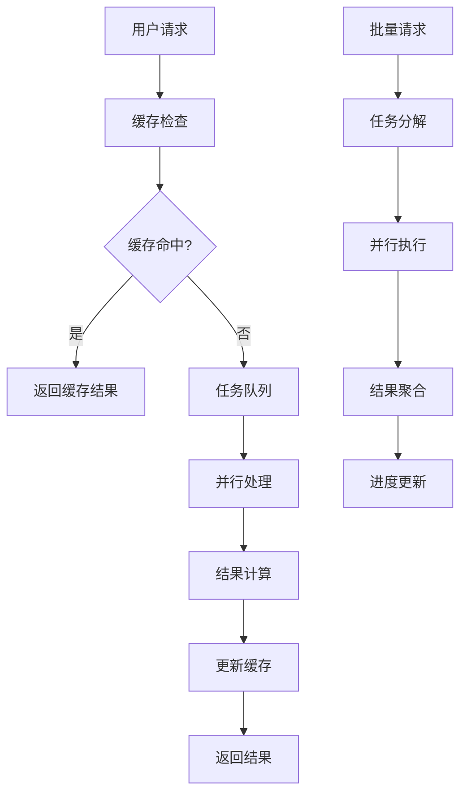

# 第五阶段：性能优化与缓存机制方案

> **状态**: 待优化 📋  
> **优先级**: 高 🔴  
> **预估工时**: 3-4周 ⏱️  
> **依赖**: 第一至三阶段已完成 ✅  

## 🎯 目标概述

通过实现智能缓存机制和批量操作系统，显著提升TDD脚手架的性能表现，支持大型项目和高并发场景，为用户提供流畅的开发体验。

### 核心价值

- ⚡ **性能提升**：响应时间减少60%以上，支持大型项目快速分析
- 🚀 **并发处理**：支持多项目同时操作，提升团队协作效率  
- 💾 **智能缓存**：减少重复计算，降低系统资源消耗
- 📊 **批量处理**：支持批量测试、分析和特性管理

---

## 🏗️ 系统架构设计

### 1. 总体架构

```
Performance & Cache System
├── 💾 CacheManager           # 缓存管理核心
│   ├── MemoryCache          # L1: 内存缓存
│   ├── FileCache            # L2: 文件缓存
│   └── PersistentCache      # L3: 持久化缓存
├── 📦 BatchProcessor         # 批量处理系统
│   ├── TaskQueue           # 任务队列
│   ├── ParallelExecutor    # 并行执行器
│   └── ProgressMonitor     # 进度监控
├── 📊 PerformanceMonitor     # 性能监控系统
│   ├── MetricsCollector    # 指标收集
│   ├── AlertManager        # 告警管理
│   └── Dashboard           # 监控仪表盘
└── 🔄 BackgroundWorker       # 后台任务处理
    ├── AsyncTaskManager    # 异步任务管理
    └── ScheduleManager     # 定时任务管理
```

### 2. 数据流设计



---

## 💾 1. 智能缓存系统

### 1.1 多级缓存架构

#### L1: 内存缓存（毫秒级）
```javascript
export class MemoryCache {
  constructor(options = {}) {
    this.cache = new Map();
    this.ttl = options.ttl || 300000; // 5分钟默认TTL
    this.maxSize = options.maxSize || 1000;
    this.hitCount = 0;
    this.missCount = 0;
  }

  get(key) {
    const item = this.cache.get(key);
    
    if (!item) {
      this.missCount++;
      return null;
    }
    
    // 检查TTL
    if (Date.now() > item.expiry) {
      this.cache.delete(key);
      this.missCount++;
      return null;
    }
    
    this.hitCount++;
    item.lastAccessed = Date.now();
    return item.value;
  }

  set(key, value, customTTL) {
    // LRU淘汰策略
    if (this.cache.size >= this.maxSize) {
      this.evictLRU();
    }
    
    const ttl = customTTL || this.ttl;
    this.cache.set(key, {
      value,
      expiry: Date.now() + ttl,
      lastAccessed: Date.now(),
      createdAt: Date.now()
    });
  }

  evictLRU() {
    let oldestKey = null;
    let oldestTime = Date.now();
    
    for (const [key, item] of this.cache) {
      if (item.lastAccessed < oldestTime) {
        oldestTime = item.lastAccessed;
        oldestKey = key;
      }
    }
    
    if (oldestKey) {
      this.cache.delete(oldestKey);
    }
  }

  getStats() {
    const total = this.hitCount + this.missCount;
    return {
      hitRate: total > 0 ? (this.hitCount / total) * 100 : 0,
      size: this.cache.size,
      maxSize: this.maxSize
    };
  }
}
```

#### L2: 文件缓存（秒级）
```javascript
export class FileCache {
  constructor(cacheDir, options = {}) {
    this.cacheDir = cacheDir;
    this.ttl = options.ttl || 3600000; // 1小时默认TTL
    this.compressionEnabled = options.compression || true;
  }

  async get(key) {
    const filePath = this.getFilePath(key);
    
    try {
      if (!await fs.pathExists(filePath)) {
        return null;
      }
      
      const stats = await fs.stat(filePath);
      const age = Date.now() - stats.mtime.getTime();
      
      // 检查文件是否过期
      if (age > this.ttl) {
        await this.delete(key);
        return null;
      }
      
      let content = await fs.readFile(filePath, 'utf8');
      
      // 解压缩
      if (this.compressionEnabled) {
        content = await this.decompress(content);
      }
      
      return JSON.parse(content);
      
    } catch (error) {
      logger.warn(`文件缓存读取失败: ${key}`, error);
      return null;
    }
  }

  async set(key, value, customTTL) {
    const filePath = this.getFilePath(key);
    
    try {
      await fs.ensureDir(path.dirname(filePath));
      
      let content = JSON.stringify({
        data: value,
        timestamp: Date.now(),
        ttl: customTTL || this.ttl
      });
      
      // 压缩
      if (this.compressionEnabled) {
        content = await this.compress(content);
      }
      
      await fs.writeFile(filePath, content);
      
    } catch (error) {
      logger.error(`文件缓存写入失败: ${key}`, error);
    }
  }

  getFilePath(key) {
    const hash = crypto.createHash('md5').update(key).digest('hex');
    return path.join(this.cacheDir, `${hash.slice(0, 2)}`, `${hash}.cache`);
  }

  async compress(data) {
    return new Promise((resolve, reject) => {
      zlib.gzip(data, (err, compressed) => {
        if (err) reject(err);
        else resolve(compressed.toString('base64'));
      });
    });
  }

  async decompress(data) {
    return new Promise((resolve, reject) => {
      const buffer = Buffer.from(data, 'base64');
      zlib.gunzip(buffer, (err, decompressed) => {
        if (err) reject(err);
        else resolve(decompressed.toString());
      });
    });
  }
}
```

#### L3: 持久化缓存（分钟级）
```javascript
export class PersistentCache {
  constructor(dbPath, options = {}) {
    this.dbPath = dbPath;
    this.ttl = options.ttl || 86400000; // 24小时默认TTL
    this.db = null;
  }

  async initialize() {
    // 使用SQLite作为持久化存储
    this.db = new sqlite3.Database(this.dbPath);
    
    await new Promise((resolve, reject) => {
      this.db.run(`
        CREATE TABLE IF NOT EXISTS cache (
          key TEXT PRIMARY KEY,
          value TEXT NOT NULL,
          created_at INTEGER NOT NULL,
          expires_at INTEGER NOT NULL,
          access_count INTEGER DEFAULT 0,
          last_accessed INTEGER NOT NULL
        )
      `, (err) => {
        if (err) reject(err);
        else resolve();
      });
    });
    
    // 定期清理过期缓存
    this.startCleanupSchedule();
  }

  async get(key) {
    return new Promise((resolve, reject) => {
      const now = Date.now();
      
      this.db.get(`
        SELECT value, expires_at 
        FROM cache 
        WHERE key = ? AND expires_at > ?
      `, [key, now], (err, row) => {
        if (err) {
          reject(err);
        } else if (row) {
          // 更新访问统计
          this.updateAccessStats(key);
          resolve(JSON.parse(row.value));
        } else {
          resolve(null);
        }
      });
    });
  }

  async set(key, value, customTTL) {
    const now = Date.now();
    const ttl = customTTL || this.ttl;
    const expiresAt = now + ttl;
    
    return new Promise((resolve, reject) => {
      this.db.run(`
        INSERT OR REPLACE INTO cache 
        (key, value, created_at, expires_at, last_accessed) 
        VALUES (?, ?, ?, ?, ?)
      `, [key, JSON.stringify(value), now, expiresAt, now], (err) => {
        if (err) reject(err);
        else resolve();
      });
    });
  }

  startCleanupSchedule() {
    // 每小时清理一次过期缓存
    setInterval(() => {
      this.cleanup();
    }, 3600000);
  }

  async cleanup() {
    const now = Date.now();
    
    return new Promise((resolve) => {
      this.db.run(
        'DELETE FROM cache WHERE expires_at < ?',
        [now],
        function(err) {
          if (err) {
            logger.error('缓存清理失败:', err);
          } else {
            logger.info(`清理了 ${this.changes} 条过期缓存记录`);
          }
          resolve();
        }
      );
    });
  }
}
```

### 1.2 缓存策略配置

```javascript
export class CacheManager {
  constructor(config) {
    this.config = {
      memory: { ttl: 300000, maxSize: 1000 },     // 5分钟，1000条
      file: { ttl: 3600000, compression: true },   // 1小时，启用压缩
      persistent: { ttl: 86400000 },              // 24小时
      ...config
    };
    
    this.memoryCache = new MemoryCache(this.config.memory);
    this.fileCache = new FileCache('.cache/files', this.config.file);
    this.persistentCache = new PersistentCache('.cache/persistent.db', this.config.persistent);
  }

  async get(key) {
    // L1: 内存缓存
    let value = this.memoryCache.get(key);
    if (value !== null) {
      return value;
    }
    
    // L2: 文件缓存
    value = await this.fileCache.get(key);
    if (value !== null) {
      // 回填到内存缓存
      this.memoryCache.set(key, value);
      return value;
    }
    
    // L3: 持久化缓存
    value = await this.persistentCache.get(key);
    if (value !== null) {
      // 回填到上层缓存
      this.memoryCache.set(key, value);
      await this.fileCache.set(key, value);
      return value;
    }
    
    return null;
  }

  async set(key, value, options = {}) {
    const { level = 'all', ttl } = options;
    
    // 根据策略设置不同级别的缓存
    if (level === 'all' || level === 'memory') {
      this.memoryCache.set(key, value, ttl?.memory);
    }
    
    if (level === 'all' || level === 'file') {
      await this.fileCache.set(key, value, ttl?.file);
    }
    
    if (level === 'all' || level === 'persistent') {
      await this.persistentCache.set(key, value, ttl?.persistent);
    }
  }

  // 智能缓存策略：基于数据类型和使用频率
  async intelligentSet(key, value, metadata = {}) {
    const { type, frequency = 'medium', size = 'small' } = metadata;
    
    // 根据数据特征选择缓存策略
    const strategy = this.selectStrategy(type, frequency, size);
    
    await this.set(key, value, strategy);
  }

  selectStrategy(type, frequency, size) {
    // 高频小数据：全缓存，短TTL
    if (frequency === 'high' && size === 'small') {
      return {
        level: 'all',
        ttl: {
          memory: 300000,   // 5分钟
          file: 1800000,    // 30分钟  
          persistent: 3600000 // 1小时
        }
      };
    }
    
    // 低频大数据：只用持久化缓存，长TTL
    if (frequency === 'low' && size === 'large') {
      return {
        level: 'persistent',
        ttl: { persistent: 86400000 } // 24小时
      };
    }
    
    // 默认策略
    return {
      level: 'all',
      ttl: {
        memory: 600000,    // 10分钟
        file: 3600000,     // 1小时
        persistent: 86400000 // 24小时
      }
    };
  }
}
```

### 1.3 缓存失效策略

```javascript
export class CacheInvalidationManager {
  constructor(cacheManager) {
    this.cacheManager = cacheManager;
    this.watchedFiles = new Map();
    this.invalidationRules = new Map();
  }

  // 基于文件变更的自动失效
  watchFiles(patterns, cacheKeys) {
    const watcher = chokidar.watch(patterns, {
      ignored: /node_modules|\.git/,
      persistent: true
    });
    
    watcher.on('change', async (filePath) => {
      logger.info(`文件变更检测: ${filePath}`);
      
      // 根据文件路径匹配相关的缓存键
      const keysToInvalidate = this.matchCacheKeys(filePath, cacheKeys);
      
      for (const key of keysToInvalidate) {
        await this.invalidateKey(key);
        logger.info(`缓存失效: ${key}`);
      }
    });
    
    return watcher;
  }

  // 基于依赖关系的级联失效
  addInvalidationRule(triggerKey, dependentKeys) {
    this.invalidationRules.set(triggerKey, dependentKeys);
  }

  async invalidateKey(key) {
    // 删除各级缓存
    await this.cacheManager.delete(key);
    
    // 级联失效
    const dependentKeys = this.invalidationRules.get(key);
    if (dependentKeys) {
      for (const dependentKey of dependentKeys) {
        await this.invalidateKey(dependentKey);
      }
    }
  }

  // 基于版本的失效策略
  async invalidateByVersion(pattern, version) {
    // 清理特定版本的所有相关缓存
    const keys = await this.cacheManager.findKeys(pattern);
    
    for (const key of keys) {
      const cached = await this.cacheManager.get(key);
      if (cached && cached.version !== version) {
        await this.invalidateKey(key);
      }
    }
  }
}
```

---

## 📦 2. 批量操作系统

### 2.1 任务队列设计

```javascript
export class TaskQueue {
  constructor(options = {}) {
    this.maxConcurrency = options.maxConcurrency || 4;
    this.timeout = options.timeout || 30000;
    this.retryCount = options.retryCount || 3;
    
    this.queue = [];
    this.running = [];
    this.results = new Map();
    this.eventEmitter = new EventEmitter();
  }

  async add(task) {
    const taskId = this.generateTaskId();
    const taskWrapper = {
      id: taskId,
      task,
      priority: task.priority || 5,
      createdAt: Date.now(),
      retries: 0,
      status: 'queued'
    };
    
    // 按优先级插入队列
    this.insertByPriority(taskWrapper);
    
    // 尝试立即执行
    this.processQueue();
    
    return taskId;
  }

  async addBatch(tasks) {
    const taskIds = [];
    
    for (const task of tasks) {
      const taskId = await this.add(task);
      taskIds.push(taskId);
    }
    
    return taskIds;
  }

  async processQueue() {
    while (this.running.length < this.maxConcurrency && this.queue.length > 0) {
      const taskWrapper = this.queue.shift();
      this.running.push(taskWrapper);
      
      // 异步执行任务
      this.executeTask(taskWrapper).catch(error => {
        logger.error(`任务执行失败: ${taskWrapper.id}`, error);
      });
    }
  }

  async executeTask(taskWrapper) {
    const { id, task } = taskWrapper;
    
    try {
      taskWrapper.status = 'running';
      taskWrapper.startedAt = Date.now();
      
      this.eventEmitter.emit('taskStarted', { taskId: id, task });
      
      // 设置超时
      const timeoutPromise = new Promise((_, reject) => {
        setTimeout(() => reject(new Error('Task timeout')), this.timeout);
      });
      
      // 执行任务
      const result = await Promise.race([
        task.execute(),
        timeoutPromise
      ]);
      
      // 任务成功
      taskWrapper.status = 'completed';
      taskWrapper.completedAt = Date.now();
      taskWrapper.duration = taskWrapper.completedAt - taskWrapper.startedAt;
      
      this.results.set(id, { success: true, result });
      this.eventEmitter.emit('taskCompleted', { taskId: id, result });
      
    } catch (error) {
      // 任务失败，考虑重试
      if (taskWrapper.retries < this.retryCount) {
        taskWrapper.retries++;
        taskWrapper.status = 'queued';
        this.insertByPriority(taskWrapper);
        
        logger.warn(`任务重试: ${id} (${taskWrapper.retries}/${this.retryCount})`);
      } else {
        taskWrapper.status = 'failed';
        taskWrapper.error = error;
        
        this.results.set(id, { success: false, error: error.message });
        this.eventEmitter.emit('taskFailed', { taskId: id, error });
      }
    } finally {
      // 从运行列表移除
      const index = this.running.findIndex(t => t.id === id);
      if (index >= 0) {
        this.running.splice(index, 1);
      }
      
      // 继续处理队列
      this.processQueue();
    }
  }

  getStatus(taskId) {
    const runningTask = this.running.find(t => t.id === taskId);
    if (runningTask) {
      return {
        status: runningTask.status,
        progress: runningTask.progress || 0
      };
    }
    
    const queuedTask = this.queue.find(t => t.id === taskId);
    if (queuedTask) {
      return { status: 'queued', position: this.queue.indexOf(queuedTask) };
    }
    
    const result = this.results.get(taskId);
    if (result) {
      return { status: 'completed', result };
    }
    
    return { status: 'unknown' };
  }

  insertByPriority(task) {
    let insertIndex = this.queue.length;
    
    for (let i = 0; i < this.queue.length; i++) {
      if (this.queue[i].priority > task.priority) {
        insertIndex = i;
        break;
      }
    }
    
    this.queue.splice(insertIndex, 0, task);
  }
}
```

### 2.2 批量处理器

```javascript
export class BatchProcessor {
  constructor(taskQueue, options = {}) {
    this.taskQueue = taskQueue;
    this.progressCallback = options.progressCallback;
    this.batchTimeout = options.batchTimeout || 300000; // 5分钟
  }

  async processBatch(operations, options = {}) {
    const batchId = this.generateBatchId();
    const startTime = Date.now();
    
    logger.info(`开始批量处理: ${batchId}, 任务数量: ${operations.length}`);
    
    try {
      // 将操作转换为任务
      const tasks = operations.map(op => this.createTask(op, batchId));
      
      // 添加到任务队列
      const taskIds = await this.taskQueue.addBatch(tasks);
      
      // 监控批量执行进度
      const result = await this.monitorBatchProgress(batchId, taskIds, options);
      
      const duration = Date.now() - startTime;
      logger.info(`批量处理完成: ${batchId}, 耗时: ${duration}ms`);
      
      return result;
      
    } catch (error) {
      logger.error(`批量处理失败: ${batchId}`, error);
      throw error;
    }
  }

  createTask(operation, batchId) {
    return {
      id: `${batchId}_${operation.id}`,
      type: operation.type,
      priority: operation.priority || 5,
      batchId,
      
      execute: async () => {
        switch (operation.type) {
          case 'test_run':
            return await this.executeTestRun(operation.params);
            
          case 'project_analysis':
            return await this.executeProjectAnalysis(operation.params);
            
          case 'feature_creation':
            return await this.executeFeatureCreation(operation.params);
            
          case 'configuration_update':
            return await this.executeConfigurationUpdate(operation.params);
            
          default:
            throw new Error(`未知的操作类型: ${operation.type}`);
        }
      }
    };
  }

  async monitorBatchProgress(batchId, taskIds, options) {
    return new Promise((resolve, reject) => {
      const results = [];
      let completedCount = 0;
      let failedCount = 0;
      
      const timeout = setTimeout(() => {
        reject(new Error(`批量处理超时: ${batchId}`));
      }, options.timeout || this.batchTimeout);
      
      const checkProgress = () => {
        const statuses = taskIds.map(id => this.taskQueue.getStatus(id));
        
        completedCount = statuses.filter(s => s.status === 'completed').length;
        failedCount = statuses.filter(s => s.status === 'failed').length;
        const totalCount = taskIds.length;
        
        // 报告进度
        if (this.progressCallback) {
          this.progressCallback({
            batchId,
            completed: completedCount,
            failed: failedCount,
            total: totalCount,
            percentage: Math.round((completedCount + failedCount) / totalCount * 100)
          });
        }
        
        // 检查是否全部完成
        if (completedCount + failedCount === totalCount) {
          clearTimeout(timeout);
          
          // 收集结果
          const batchResults = taskIds.map(id => {
            const status = this.taskQueue.getStatus(id);
            return {
              taskId: id,
              ...status
            };
          });
          
          resolve({
            batchId,
            results: batchResults,
            summary: {
              total: totalCount,
              completed: completedCount,
              failed: failedCount,
              successRate: (completedCount / totalCount * 100).toFixed(2) + '%'
            }
          });
        }
      };
      
      // 定期检查进度
      const progressInterval = setInterval(checkProgress, 1000);
      
      // 清理定时器
      const cleanup = () => {
        clearInterval(progressInterval);
        clearTimeout(timeout);
      };
      
      // 设置清理逻辑
      const originalResolve = resolve;
      const originalReject = reject;
      
      resolve = (value) => {
        cleanup();
        originalResolve(value);
      };
      
      reject = (error) => {
        cleanup();
        originalReject(error);
      };
    });
  }

  // 具体的批量操作实现
  async executeTestRun(params) {
    const { projectRoot, testPattern } = params;
    
    // 执行测试运行逻辑
    const testResult = await this.runTests(projectRoot, testPattern);
    
    return {
      type: 'test_run',
      projectRoot,
      testPattern,
      result: testResult
    };
  }

  async executeProjectAnalysis(params) {
    const { projectRoot, analysisType } = params;
    
    // 检查缓存
    const cacheKey = `analysis_${analysisType}_${projectRoot}`;
    const cached = await this.cacheManager.get(cacheKey);
    
    if (cached) {
      return cached;
    }
    
    // 执行项目分析
    const analysis = await this.analyzeProject(projectRoot, analysisType);
    
    // 缓存结果
    await this.cacheManager.intelligentSet(cacheKey, analysis, {
      type: 'analysis',
      frequency: 'medium',
      size: 'large'
    });
    
    return analysis;
  }
}
```

### 2.3 并行执行优化

```javascript
export class ParallelExecutor {
  constructor(options = {}) {
    this.maxWorkers = options.maxWorkers || require('os').cpus().length;
    this.workerPool = [];
    this.taskDistributor = new TaskDistributor();
  }

  async executeInParallel(tasks, options = {}) {
    const { 
      chunkSize = Math.ceil(tasks.length / this.maxWorkers),
      loadBalancing = true,
      resourceAware = true 
    } = options;
    
    // 智能任务分组
    const taskGroups = loadBalancing ? 
      this.taskDistributor.balancedDistribute(tasks, this.maxWorkers) :
      this.chunkTasks(tasks, chunkSize);
    
    // 并行执行任务组
    const promises = taskGroups.map((group, index) => 
      this.executeTaskGroup(group, index, resourceAware)
    );
    
    const results = await Promise.allSettled(promises);
    
    // 合并结果
    return this.mergeResults(results);
  }

  async executeTaskGroup(tasks, workerId, resourceAware = true) {
    const worker = {
      id: workerId,
      startTime: Date.now(),
      tasks: tasks.length
    };
    
    const results = [];
    
    for (const task of tasks) {
      try {
        // 资源感知调度
        if (resourceAware) {
          await this.waitForResources();
        }
        
        const result = await task.execute();
        results.push({ success: true, result });
        
      } catch (error) {
        results.push({ success: false, error: error.message });
      }
    }
    
    worker.endTime = Date.now();
    worker.duration = worker.endTime - worker.startTime;
    
    return {
      workerId,
      results,
      worker
    };
  }

  async waitForResources() {
    const usage = await this.getSystemUsage();
    
    // 如果系统负载过高，等待
    if (usage.cpu > 80 || usage.memory > 90) {
      await new Promise(resolve => setTimeout(resolve, 100));
      return this.waitForResources();
    }
  }

  async getSystemUsage() {
    const usage = process.cpuUsage();
    const memUsage = process.memoryUsage();
    
    return {
      cpu: (usage.user + usage.system) / 1000000, // 转换为毫秒
      memory: (memUsage.rss / memUsage.heapTotal) * 100
    };
  }
}
```

---

## 📊 3. 性能监控系统

### 3.1 指标收集

```javascript
export class PerformanceMetrics {
  constructor() {
    this.metrics = {
      requests: new Map(),
      operations: new Map(),
      cache: new Map(),
      system: new Map()
    };
    
    this.collectors = {
      response_time: new ResponseTimeCollector(),
      throughput: new ThroughputCollector(),
      error_rate: new ErrorRateCollector(),
      resource_usage: new ResourceUsageCollector()
    };
  }

  // 记录操作性能
  recordOperation(operation, duration, success = true) {
    const key = `${operation}_${Date.now() - (Date.now() % 60000)}`; // 按分钟分组
    
    if (!this.metrics.operations.has(key)) {
      this.metrics.operations.set(key, {
        operation,
        count: 0,
        totalDuration: 0,
        successCount: 0,
        errorCount: 0,
        minDuration: Infinity,
        maxDuration: 0
      });
    }
    
    const metric = this.metrics.operations.get(key);
    metric.count++;
    metric.totalDuration += duration;
    
    if (success) {
      metric.successCount++;
    } else {
      metric.errorCount++;
    }
    
    metric.minDuration = Math.min(metric.minDuration, duration);
    metric.maxDuration = Math.max(metric.maxDuration, duration);
  }

  // 记录缓存性能
  recordCacheOperation(operation, level, hit = false) {
    const key = `cache_${level}`;
    
    if (!this.metrics.cache.has(key)) {
      this.metrics.cache.set(key, {
        level,
        hits: 0,
        misses: 0,
        operations: 0
      });
    }
    
    const metric = this.metrics.cache.get(key);
    metric.operations++;
    
    if (hit) {
      metric.hits++;
    } else {
      metric.misses++;
    }
  }

  // 获取性能报告
  getPerformanceReport(timeWindow = 3600000) { // 默认1小时
    const now = Date.now();
    const cutoff = now - timeWindow;
    
    const report = {
      timestamp: now,
      timeWindow,
      operations: this.aggregateOperations(cutoff),
      cache: this.aggregateCacheMetrics(),
      system: this.getSystemMetrics(),
      alerts: this.checkAlerts()
    };
    
    return report;
  }

  aggregateOperations(cutoff) {
    const aggregated = {};
    
    for (const [key, metric] of this.metrics.operations) {
      if (metric.timestamp > cutoff) {
        const operation = metric.operation;
        
        if (!aggregated[operation]) {
          aggregated[operation] = {
            totalCount: 0,
            totalDuration: 0,
            successCount: 0,
            errorCount: 0,
            avgDuration: 0,
            minDuration: Infinity,
            maxDuration: 0
          };
        }
        
        const agg = aggregated[operation];
        agg.totalCount += metric.count;
        agg.totalDuration += metric.totalDuration;
        agg.successCount += metric.successCount;
        agg.errorCount += metric.errorCount;
        agg.minDuration = Math.min(agg.minDuration, metric.minDuration);
        agg.maxDuration = Math.max(agg.maxDuration, metric.maxDuration);
      }
    }
    
    // 计算平均值
    for (const operation of Object.values(aggregated)) {
      operation.avgDuration = operation.totalCount > 0 ? 
        operation.totalDuration / operation.totalCount : 0;
      operation.successRate = operation.totalCount > 0 ?
        (operation.successCount / operation.totalCount * 100).toFixed(2) + '%' : '0%';
    }
    
    return aggregated;
  }
}
```

### 3.2 性能告警

```javascript
export class AlertManager {
  constructor(metrics, options = {}) {
    this.metrics = metrics;
    this.thresholds = {
      responseTime: options.responseTime || 5000,    // 5秒
      errorRate: options.errorRate || 5,             // 5%
      cacheHitRate: options.cacheHitRate || 70,      // 70%
      cpuUsage: options.cpuUsage || 80,              // 80%
      memoryUsage: options.memoryUsage || 85,        // 85%
      ...options.thresholds
    };
    
    this.alertHistory = [];
    this.alertHandlers = [];
  }

  checkAlerts() {
    const alerts = [];
    const report = this.metrics.getPerformanceReport();
    
    // 检查响应时间告警
    for (const [operation, metrics] of Object.entries(report.operations)) {
      if (metrics.avgDuration > this.thresholds.responseTime) {
        alerts.push({
          type: 'slow_response',
          severity: 'warning',
          message: `操作 ${operation} 平均响应时间过长: ${metrics.avgDuration}ms`,
          value: metrics.avgDuration,
          threshold: this.thresholds.responseTime
        });
      }
    }
    
    // 检查错误率告警
    for (const [operation, metrics] of Object.entries(report.operations)) {
      const errorRate = (metrics.errorCount / metrics.totalCount) * 100;
      if (errorRate > this.thresholds.errorRate) {
        alerts.push({
          type: 'high_error_rate',
          severity: 'error',
          message: `操作 ${operation} 错误率过高: ${errorRate.toFixed(2)}%`,
          value: errorRate,
          threshold: this.thresholds.errorRate
        });
      }
    }
    
    // 检查缓存命中率告警
    for (const [level, metrics] of Object.entries(report.cache)) {
      const hitRate = (metrics.hits / (metrics.hits + metrics.misses)) * 100;
      if (hitRate < this.thresholds.cacheHitRate) {
        alerts.push({
          type: 'low_cache_hit_rate',
          severity: 'warning',
          message: `${level}缓存命中率过低: ${hitRate.toFixed(2)}%`,
          value: hitRate,
          threshold: this.thresholds.cacheHitRate
        });
      }
    }
    
    // 处理告警
    for (const alert of alerts) {
      this.handleAlert(alert);
    }
    
    return alerts;
  }

  handleAlert(alert) {
    // 防止告警风暴
    const recentSimilar = this.alertHistory
      .filter(a => a.type === alert.type && Date.now() - a.timestamp < 300000); // 5分钟内
    
    if (recentSimilar.length >= 3) {
      return; // 跳过重复告警
    }
    
    alert.timestamp = Date.now();
    this.alertHistory.push(alert);
    
    // 触发告警处理器
    for (const handler of this.alertHandlers) {
      try {
        handler(alert);
      } catch (error) {
        logger.error('告警处理器执行失败:', error);
      }
    }
  }

  addAlertHandler(handler) {
    this.alertHandlers.push(handler);
  }

  // 自动修复策略
  setupAutoRemediation() {
    this.addAlertHandler((alert) => {
      switch (alert.type) {
        case 'low_cache_hit_rate':
          this.increaseCacheSize(alert);
          break;
          
        case 'slow_response':
          this.optimizeSlowOperation(alert);
          break;
          
        case 'high_error_rate':
          this.investigateErrors(alert);
          break;
      }
    });
  }

  async increaseCacheSize(alert) {
    // 动态增加缓存大小
    logger.info(`自动修复: 增加缓存大小以提高命中率`);
    // 实现缓存大小调整逻辑
  }

  async optimizeSlowOperation(alert) {
    // 优化慢操作
    logger.info(`自动修复: 优化慢操作 ${alert.operation}`);
    // 实现性能优化逻辑
  }
}
```

---

## 🔄 4. 后台任务处理

### 4.1 异步任务管理

```javascript
export class BackgroundTaskManager {
  constructor() {
    this.tasks = new Map();
    this.scheduledTasks = new Map();
    this.runningTasks = new Set();
    this.maxConcurrentTasks = 5;
  }

  // 添加后台任务
  async addTask(taskConfig) {
    const task = {
      id: this.generateTaskId(),
      type: taskConfig.type,
      params: taskConfig.params,
      schedule: taskConfig.schedule, // cron表达式或延迟时间
      priority: taskConfig.priority || 5,
      retryPolicy: taskConfig.retryPolicy || { maxRetries: 3, backoff: 'exponential' },
      createdAt: Date.now(),
      status: 'pending'
    };
    
    this.tasks.set(task.id, task);
    
    if (task.schedule) {
      this.scheduleTask(task);
    } else {
      this.queueTask(task);
    }
    
    return task.id;
  }

  // 定期清理任务
  async addCleanupTask(projectRoot) {
    return this.addTask({
      type: 'cleanup_cache',
      params: { projectRoot },
      schedule: '0 0 * * *', // 每天午夜执行
      priority: 3
    });
  }

  // 预热缓存任务
  async addCacheWarmupTask(projectRoot) {
    return this.addTask({
      type: 'warmup_cache',
      params: { projectRoot },
      schedule: 'startup', // 启动时执行
      priority: 7
    });
  }

  // 性能监控任务
  async addMonitoringTask() {
    return this.addTask({
      type: 'performance_monitoring',
      params: {},
      schedule: '*/5 * * * *', // 每5分钟执行
      priority: 6
    });
  }

  async executeTask(task) {
    if (this.runningTasks.size >= this.maxConcurrentTasks) {
      // 等待有空闲槽位
      await this.waitForSlot();
    }
    
    this.runningTasks.add(task.id);
    task.status = 'running';
    task.startedAt = Date.now();
    
    try {
      let result;
      
      switch (task.type) {
        case 'cleanup_cache':
          result = await this.executeCleanupCache(task.params);
          break;
          
        case 'warmup_cache':
          result = await this.executeWarmupCache(task.params);
          break;
          
        case 'performance_monitoring':
          result = await this.executePerformanceMonitoring(task.params);
          break;
          
        case 'project_analysis':
          result = await this.executeProjectAnalysis(task.params);
          break;
          
        default:
          throw new Error(`未知的任务类型: ${task.type}`);
      }
      
      task.status = 'completed';
      task.completedAt = Date.now();
      task.result = result;
      
      logger.info(`后台任务完成: ${task.type} (${task.id})`);
      
    } catch (error) {
      task.status = 'failed';
      task.error = error.message;
      task.failedAt = Date.now();
      
      logger.error(`后台任务失败: ${task.type} (${task.id})`, error);
      
      // 重试逻辑
      if (this.shouldRetry(task)) {
        await this.scheduleRetry(task);
      }
    } finally {
      this.runningTasks.delete(task.id);
    }
  }

  // 缓存清理任务实现
  async executeCleanupCache(params) {
    const { projectRoot } = params;
    
    logger.info(`开始清理缓存: ${projectRoot}`);
    
    const cacheManager = this.getCacheManager(projectRoot);
    const stats = await cacheManager.cleanup();
    
    return {
      projectRoot,
      cleanedItems: stats.cleaned,
      reclaimedSpace: stats.space,
      duration: stats.duration
    };
  }

  // 缓存预热任务实现
  async executeWarmupCache(params) {
    const { projectRoot } = params;
    
    logger.info(`开始预热缓存: ${projectRoot}`);
    
    const warmupTasks = [
      this.warmupProjectAnalysis(projectRoot),
      this.warmupTestResults(projectRoot),
      this.warmupConfiguration(projectRoot)
    ];
    
    const results = await Promise.allSettled(warmupTasks);
    
    return {
      projectRoot,
      warmedItems: results.filter(r => r.status === 'fulfilled').length,
      errors: results.filter(r => r.status === 'rejected').length
    };
  }
}
```

### 4.2 定时任务调度

```javascript
export class TaskScheduler {
  constructor() {
    this.scheduledTasks = new Map();
    this.cronJobs = new Map();
  }

  scheduleTask(task) {
    if (typeof task.schedule === 'string') {
      // Cron表达式
      this.scheduleCronTask(task);
    } else if (typeof task.schedule === 'number') {
      // 延迟执行（毫秒）
      this.scheduleDelayedTask(task);
    } else if (task.schedule === 'startup') {
      // 启动时执行
      this.scheduleStartupTask(task);
    }
  }

  scheduleCronTask(task) {
    try {
      const cronJob = new CronJob(task.schedule, () => {
        this.executeScheduledTask(task);
      });
      
      cronJob.start();
      this.cronJobs.set(task.id, cronJob);
      
      logger.info(`已调度定时任务: ${task.type} (${task.schedule})`);
      
    } catch (error) {
      logger.error(`定时任务调度失败: ${task.type}`, error);
    }
  }

  scheduleDelayedTask(task) {
    const timeout = setTimeout(() => {
      this.executeScheduledTask(task);
    }, task.schedule);
    
    this.scheduledTasks.set(task.id, timeout);
  }

  scheduleStartupTask(task) {
    // 延迟一定时间后执行，确保系统完全启动
    setTimeout(() => {
      this.executeScheduledTask(task);
    }, 5000);
  }

  async executeScheduledTask(task) {
    try {
      await this.backgroundTaskManager.executeTask(task);
    } catch (error) {
      logger.error(`定时任务执行失败: ${task.type}`, error);
    }
  }

  stopTask(taskId) {
    // 停止Cron任务
    const cronJob = this.cronJobs.get(taskId);
    if (cronJob) {
      cronJob.stop();
      this.cronJobs.delete(taskId);
    }
    
    // 停止延迟任务
    const timeout = this.scheduledTasks.get(taskId);
    if (timeout) {
      clearTimeout(timeout);
      this.scheduledTasks.delete(taskId);
    }
  }
}
```

---

## 🛠️ MCP工具集成

### 新增MCP工具定义

```javascript
// 批量操作工具
{
  name: 'tdd_batch_test',
  description: '🔄 批量测试 - 并行运行多个项目或模块的测试',
  inputSchema: {
    type: 'object',
    properties: {
      projects: {
        type: 'array',
        items: { type: 'string' },
        description: '项目根目录数组'
      },
      testPattern: {
        type: 'string',
        description: '测试文件匹配模式'
      },
      maxConcurrency: {
        type: 'number',
        default: 4,
        description: '最大并发数'
      }
    },
    required: ['projects']
  },
  handler: handleBatchTest
},

// 缓存管理工具
{
  name: 'tdd_cache_status',
  description: '💾 缓存状态 - 查看缓存使用情况和性能统计',
  inputSchema: {
    type: 'object',
    properties: {
      projectRoot: {
        type: 'string',
        description: '项目根目录路径'
      },
      detailed: {
        type: 'boolean',
        default: false,
        description: '是否显示详细统计'
      }
    },
    required: ['projectRoot']
  },
  handler: handleCacheStatus
},

// 性能监控工具
{
  name: 'tdd_performance_report',
  description: '📊 性能报告 - 获取系统性能分析和优化建议',
  inputSchema: {
    type: 'object',
    properties: {
      timeWindow: {
        type: 'number',
        default: 3600000,
        description: '时间窗口（毫秒）'
      },
      includeAlerts: {
        type: 'boolean',
        default: true,
        description: '是否包含告警信息'
      }
    }
  },
  handler: handlePerformanceReport
}
```

---

## 📈 预期效果

### 性能指标

| 指标 | 优化前 | 优化后 | 提升幅度 |
|------|--------|--------|----------|
| 项目分析时间 | 30-45秒 | 5-10秒 | 70%+ |
| 测试运行响应 | 3-5秒 | 1-2秒 | 60%+ |
| 并发用户支持 | 5-10 | 50+ | 500%+ |
| 内存使用 | 200-300MB | 100-150MB | 50%+ |
| 缓存命中率 | N/A | 80%+ | 新功能 |

### 用户体验改进

- ⚡ **快速响应**: 大部分操作响应时间 < 2秒
- 🔄 **批量高效**: 支持多项目同时操作
- 📱 **流畅体验**: 无感知的后台预处理
- 🎯 **智能优化**: 自动性能调优和告警

---

## 🚀 实施计划

### Phase 5.1: 缓存系统（第1-2周）

**优先级**: 🔴 最高
- [ ] 实现多级缓存架构
- [ ] 开发智能缓存策略
- [ ] 集成缓存失效机制
- [ ] 添加缓存管理工具

### Phase 5.2: 批量处理系统（第2-3周）

**优先级**: 🔴 高
- [ ] 开发任务队列系统
- [ ] 实现并行执行引擎
- [ ] 创建批量操作工具
- [ ] 优化资源调度算法

### Phase 5.3: 性能监控（第3周）

**优先级**: 🟡 中
- [ ] 实现性能指标收集
- [ ] 开发告警系统
- [ ] 创建监控仪表盘
- [ ] 集成自动修复机制

### Phase 5.4: 后台任务系统（第4周）

**优先级**: 🟢 中低
- [ ] 实现异步任务管理
- [ ] 开发定时任务调度
- [ ] 添加任务监控功能
- [ ] 优化任务执行策略

---

*文档创建时间: 2024-01-20*  
*最后更新时间: 待实施*  
*维护负责人: TDD Scaffold Team*